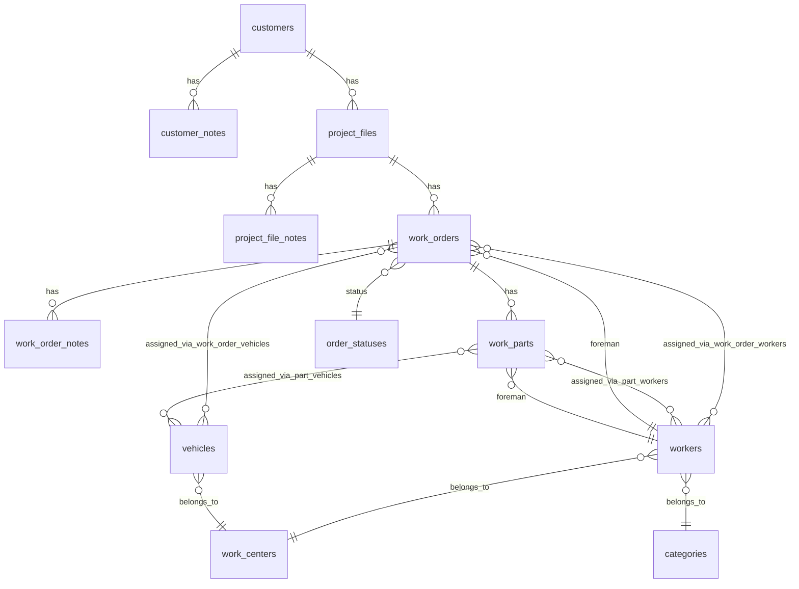

# WorkFrame Database Schema

All table and field names follow PSR conventions (snake_case, English).

## Entity Relationship Diagram

## Tables

### sections
| Column | Type | Notes |
|--------|------|-------|
| id | INT UNSIGNED AI PK | |
| name | VARCHAR(60) | Indexed |
| active | BOOLEAN | Default: true |

### categories
| Column | Type | Notes |
|--------|------|-------|
| id | INT UNSIGNED AI PK | |
| name | VARCHAR(60) | Indexed |
| active | BOOLEAN | Default: true |

### work_centers
| Column | Type | Notes |
|--------|------|-------|
| id | INT UNSIGNED AI PK | |
| name | VARCHAR(60) | Indexed |
| active | BOOLEAN | Default: true |

### order_statuses
| Column | Type | Notes |
|--------|------|-------|
| id | INT UNSIGNED AI PK | |
| name | VARCHAR(25) | Indexed |
| visible | BOOLEAN | Default: false |
| active | BOOLEAN | Default: true |

### workers
| Column | Type | Notes |
|--------|------|-------|
| id | INT UNSIGNED AI PK | |
| name | VARCHAR(60) | |
| work_center_id | INT UNSIGNED | FK → work_centers |
| category_id | INT UNSIGNED | FK → categories |
| email | VARCHAR(50) | |
| available_from | DATE | Availability window |
| available_until | DATE | Availability window |
| active | BOOLEAN | Default: true |

### vehicles
| Column | Type | Notes |
|--------|------|-------|
| id | INT UNSIGNED AI PK | |
| name | VARCHAR(60) | |
| work_center_id | INT UNSIGNED | FK → work_centers |
| license_plate | VARCHAR(15) | |
| active | BOOLEAN | Default: true |

### customers
| Column | Type | Notes |
|--------|------|-------|
| id | INT UNSIGNED AI PK | |
| name | VARCHAR(60) | |
| contact | VARCHAR(60) | |
| address | VARCHAR(50) | |
| zip | VARCHAR(10) | |
| locality | VARCHAR(50) | |
| town | VARCHAR(25) | |
| telephone | VARCHAR(15) | |
| email | VARCHAR(50) | |
| active | BOOLEAN | Default: true |

### customer_notes
| Column | Type | Notes |
|--------|------|-------|
| id | TIMESTAMP PK | Auto-generated |
| customer_id | INT UNSIGNED | FK → customers |
| source | BOOLEAN | Default: false |
| notes | TEXT | |

### project_files
| Column | Type | Notes |
|--------|------|-------|
| id | INT UNSIGNED AI PK | |
| name | VARCHAR(60) | |
| customer_id | INT UNSIGNED | FK → customers |
| date | DATE | |
| locality | VARCHAR(50) | |
| town | VARCHAR(50) | |
| active | BOOLEAN | Default: true |

### project_file_notes
| Column | Type | Notes |
|--------|------|-------|
| id | TIMESTAMP PK | Auto-generated |
| project_file_id | INT UNSIGNED | FK → project_files |
| source | BOOLEAN | Default: false |
| notes | TEXT | |

### work_orders
| Column | Type | Notes |
|--------|------|-------|
| id | INT UNSIGNED AI PK | |
| name | VARCHAR(60) | |
| project_file_id | INT UNSIGNED | FK → project_files |
| date | DATE | Start date |
| end_date | DATE | Default: 9999-12-31 |
| start_time | TIME | Default: 09:00:00 |
| foreman_id | INT UNSIGNED | FK → workers |
| address | VARCHAR(50) | |
| zip | VARCHAR(10) | |
| locality | VARCHAR(50) | |
| town | VARCHAR(50) | |
| status | TINYINT | FK → order_statuses |
| active | BOOLEAN | Default: true |

### work_order_notes
| Column | Type | Notes |
|--------|------|-------|
| id | TIMESTAMP PK | |
| work_order_id | INT UNSIGNED | FK → work_orders |
| source | BOOLEAN | Default: false |
| notes | TEXT | |

### work_order_workers (pivot)
| Column | Type | Notes |
|--------|------|-------|
| work_order_id | INT UNSIGNED | PK, FK → work_orders |
| worker_id | INT UNSIGNED | PK, FK → workers |

### work_order_vehicles (pivot)
| Column | Type | Notes |
|--------|------|-------|
| work_order_id | INT UNSIGNED | PK, FK → work_orders |
| vehicle_id | INT UNSIGNED | PK, FK → vehicles |

### work_parts
| Column | Type | Notes |
|--------|------|-------|
| id | INT UNSIGNED AI PK | |
| name | VARCHAR(60) | |
| work_order_id | INT UNSIGNED | FK → work_orders |
| foreman_id | INT UNSIGNED | FK → workers |
| special_time | BOOLEAN | Default: false |
| has_image | CHAR(3) | File extension or null |
| has_invoice | CHAR(3) | File extension or null |
| notes | TEXT | |
| date | DATE | |

### part_vehicles (pivot)
| Column | Type | Notes |
|--------|------|-------|
| work_part_id | INT UNSIGNED | PK, FK → work_parts |
| vehicle_id | INT UNSIGNED | PK, FK → vehicles |

### part_workers (pivot, with time tracking)
| Column | Type | Notes |
|--------|------|-------|
| work_part_id | INT UNSIGNED | PK, FK → work_parts |
| worker_id | INT UNSIGNED | PK, FK → workers |
| going_start | TIME | Travel to site start |
| going_end | TIME | Travel to site end |
| back_start | TIME | Return travel start |
| back_end | TIME | Return travel end |
| morning_from | TIME | Morning shift start |
| morning_to | TIME | Morning shift end |
| afternoon_from | TIME | Afternoon shift start |
| afternoon_to | TIME | Afternoon shift end |
| allowances | CHAR(1) | Per diem code |
| active | BOOLEAN | Default: true |

### mail_configs
| Column | Type | Notes |
|--------|------|-------|
| id | INT UNSIGNED AI PK | |
| host | VARCHAR(100) | IMAP server |
| port | INT | Default: 993 |
| username | VARCHAR(100) | |
| password | VARCHAR(100) | |
| ssl | BOOLEAN | Default: true |
