# Manual de Usuario: Aplicación Legada WorkFrame (Obras)

Este manual documenta exhaustivamente las funcionalidades y flujos de trabajo de la aplicación original "Obras" (`https://obras.local`), basada en CodeIgniter 3 con Bootstrap 3 / AdminLTE. Sirve como referencia para el desarrollo del módulo WorkFrame en Alxarafe.

> [!NOTE]
> Este manual fue generado mediante exploración directa de la aplicación el 06/03/2026. Algunas funcionalidades están **rotas o incompletas** en la versión legada y se documentan como tal.

---

## 1. Autenticación

**URL:** `https://obras.local/auth`

La aplicación redirige automáticamente a la página de login si no hay sesión activa.

**Campos del formulario:**
| Campo | Tipo | Nombre HTML |
|-------|------|-------------|
| Usuario | Texto | `username` |
| Contraseña | Password | `password` |
| Recordar | Checkbox | `remember-me` |

**Botón:** "Acceder al área privada" (POST a `/auth/login`).

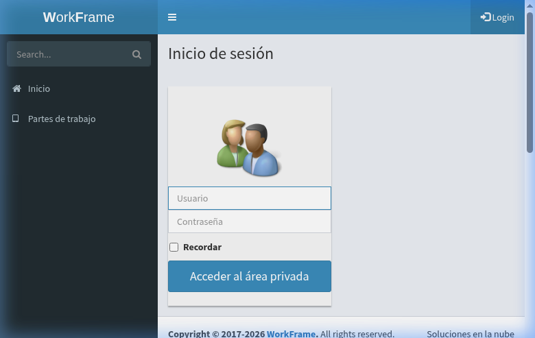

---

## 2. Dashboard (Panel Principal)

**URL:** `https://obras.local/dashboard`

Tras iniciar sesión, se muestra la "**Visión general del calendario de obras**".

**Elementos principales:**
- **Filtro de fecha:** Campo "Mostrar órdenes posteriores a" con selector de fecha y botón "Ok".
- **Pestañas de visualización:**
  - **Vista rápida** — Tabla resumen con columnas: Expediente, Fec.Exp., OT/Nom.Exp./Cliente, Día, Fec.Orden, Hora, Localidad/Provincia.
  - **Órdenes de trabajo** — Vista filtrada por órdenes.
  - **Vehículos** — Vista de vehículos asignados.
  - **Operarios** — Vista de operarios asignados.

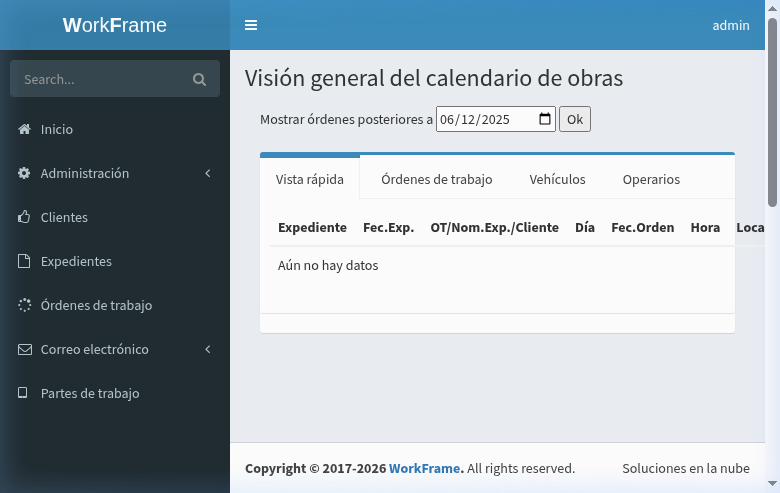

---

## 3. Navegación (Sidebar)

El menú lateral siempre visible contiene:

| Sección | URL | Descripción |
|---------|-----|-------------|
| **Inicio** | `/` | Dashboard |
| **Administración** | *(desplegable)* | Gestión de tablas maestras |
| → Usuarios | `/administracion/users` | Gestión de cuentas de usuario |
| → Roles | `/administracion/roles` | Configuración de roles |
| → Secciones | `/administracion/sections` | Agrupaciones de categorías |
| → Categorías | `/administracion/categories` | Tipos de trabajador |
| → Delegaciones | `/administracion/workcenters` | Centros de trabajo |
| → Empleados | `/administracion/workers` | Gestión de operarios |
| → Vehículos | `/administracion/vehicles` | Flota de vehículos |
| → Estados de órdenes | `/administracion/orderstatus` | Estados para órdenes |
| **Clientes** | `/clientes` | Gestión de clientes |
| **Expedientes** | `/expedientes` | Proyectos/contratos |
| **Órdenes de trabajo** | `/ordenes` | Órdenes operativas |
| **Correo electrónico** | *(desplegable)* | Módulo de email |
| → Procesar correo | `/mail` | Procesado de emails |
| → Configurar | `/mail/config` | Configuración SMTP |
| **Partes de trabajo** | `/partes` | Registro diario de actividad |

Además incluye un **buscador global** en la parte superior del sidebar.

---

## 4. Administración — Tablas Maestras

Todas las tablas de administración comparten un **patrón de edición en línea (inline grid)**. Los registros se editan directamente en la tabla y los cambios se guardan pulsando "Aceptar".

### Botones comunes:
| Botón | Acción |
|-------|--------|
| **Añadir** | Inserta una fila vacía editable |
| **Listar** | Refresca la tabla |
| **Aceptar** | Guarda todos los cambios |
| **Salir** | Volver al dashboard |

---

### 4.1. Secciones

**URL:** `/administracion/sections`

| Columna | Tipo |
|---------|------|
| ID | Numérico (auto) |
| Nombre | Texto editable |
| Activo | Checkbox |

**Datos existentes:** Material de construcción, Fontanería, Materiales varios, Herramientas.

> [!WARNING]
> **[BUG LEGADO]** El botón "Añadir" devuelve un error **404**. La creación de secciones nuevas no funciona.

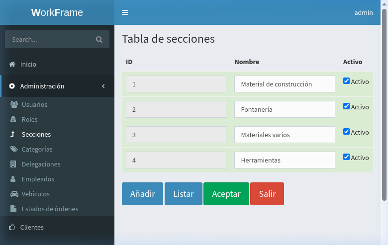

---

### 4.2. Categorías

**URL:** `/administracion/categories`

| Columna | Tipo |
|---------|------|
| ID | Numérico (auto) |
| Nombre | Texto editable |
| Activo | Checkbox |
| Borrar | Checkbox |

**Datos existentes:** Fontanero, Carpintero.

**Comportamiento:** Al pulsar "Añadir" se crea una fila editable vacía con Activo marcado por defecto.

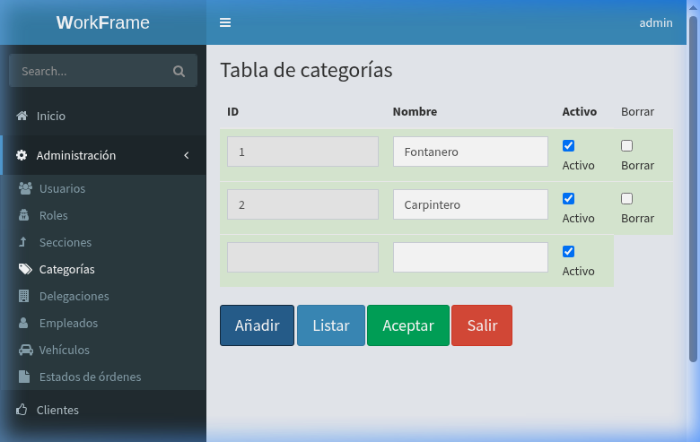

---

### 4.3. Delegaciones (Centros de Trabajo)

**URL:** `/administracion/workcenters`

| Columna | Tipo |
|---------|------|
| ID | Numérico (auto) |
| Nombre | Texto editable |
| Activo | Checkbox |
| Borrar | Checkbox |

**Datos existentes:** Madrid, Sevilla.

---

### 4.4. Estados de Órdenes

**URL:** `/administracion/orderstatus`

| Columna | Tipo | Descripción |
|---------|------|-------------|
| ID | Numérico | |
| Nombre | Texto editable | |
| Mostrar | Checkbox | Controla si aparece en filtros por defecto |
| Activo | Checkbox | |
| Borrar | Checkbox | |

**Datos existentes:** Activa (Mostrar: ✓), Finalizada (Mostrar: ✓), Cancelada (Mostrar: ✗).

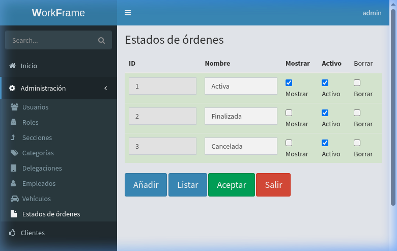

---

### 4.5. Gestión de Usuarios

**URL:** `/administracion/users`

| Columna | Tipo |
|---------|------|
| ID | Nombre de usuario |
| Nombre | Texto editable |
| Correo electrónico | Email editable |
| Operario | Dropdown (vincula usuario con trabajador) |
| Activo | Checkbox |
| Roles | Botón (redirige a `/administracion/editroles/[username]`) |

**Datos existentes:** admin (vinculado a Juan P), user.

**Característica clave:** La columna **Operario** vincula la cuenta de usuario con un registro de la tabla de trabajadores. Esto es crucial para identificar "Jefes de Equipo" (encargados) que recibirán notificaciones y podrán crear partes de trabajo.

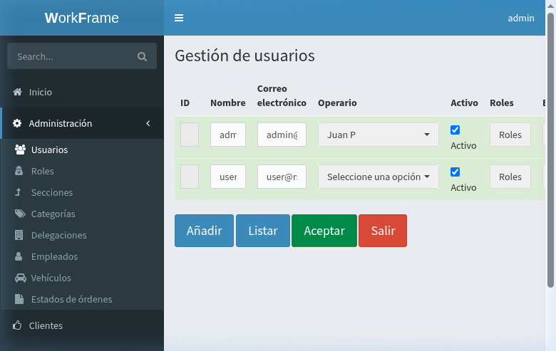

---

### 4.6. Roles

**URL:** `/administracion/roles`

| Columna | Tipo |
|---------|------|
| ID | Numérico |
| Nombre | Texto editable |
| Activo | Checkbox |
| Borrar | Checkbox |

**Datos existentes:** Administrador, Usuario.

---

## 5. Gestión de Empleados (Trabajadores)

**URL del listado:** `/administracion/workers`

### 5.1. Listado

| Columna | Descripción |
|---------|-------------|
| ID | Identificador numérico |
| Nombre | Nombre del trabajador (enlace a edición) |
| Delegación | Centro de trabajo asignado |
| Categoría | Oficio/especialidad |
| Informe | Enlace a `/reports/operarios/{id}` |
| Correo electrónico | Email del trabajador |
| Baja desde | Fecha de inicio de baja temporal |
| Baja hasta | Fecha de fin de baja temporal |

**Buscador:** Campo de búsqueda superior para filtrar la tabla.
**Paginación:** "Mostrando página X de Y" con botones Anterior/Siguiente.

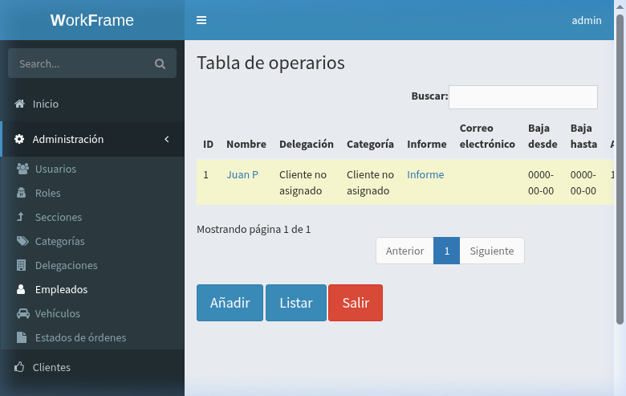

### 5.2. Formulario de Edición

**URL:** `/administracion/workers/{id}`

| Campo | Tipo | Descripción |
|-------|------|-------------|
| ID | Numérico (solo lectura) | Asignado automáticamente |
| Nombre | Texto | Nombre completo |
| Delegación | Dropdown | Centro de trabajo |
| Categoría | Dropdown | Especialidad profesional |
| Correo electrónico | Email | Para notificaciones |
| Informe | Botón | Enlace al informe del operario |
| Baja desde | Date picker | Inicio de indisponibilidad |
| Baja hasta | Date picker | Fin de indisponibilidad |

**Botones:** Guardar, Salir.

**Patrón de creación:** Al pulsar "Añadir" en el listado, primero aparece un formulario solo con el campo **ID**. Tras introducir (o dejar vacío para auto-asignación) y pulsar "Guardar", se despliega el formulario completo.

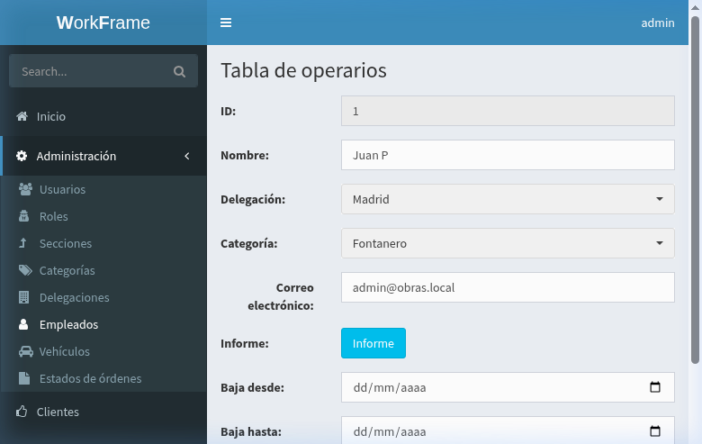

---

## 6. Gestión de Vehículos

**URL del listado:** `/administracion/vehicles`

### 6.1. Listado

| Columna | Descripción |
|---------|-------------|
| ID | Identificador numérico |
| Nombre | Descripción del vehículo |
| Delegación | Centro de trabajo |
| Matrícula | Matrícula del vehículo |
| Activo | Estado de actividad |

### 6.2. Formulario de Edición

**URL:** `/administracion/vehicles/{id}`

| Campo | Tipo | Descripción |
|-------|------|-------------|
| ID | Numérico | Auto o manual |
| Nombre | Texto (max 60 chars) | Descripción |
| Delegación | Dropdown | Centro de trabajo |
| Matrícula | Texto | Matrícula del vehículo |
| Activo | Checkbox | Estado |

**Botones:** Guardar, Salir, Borrar.

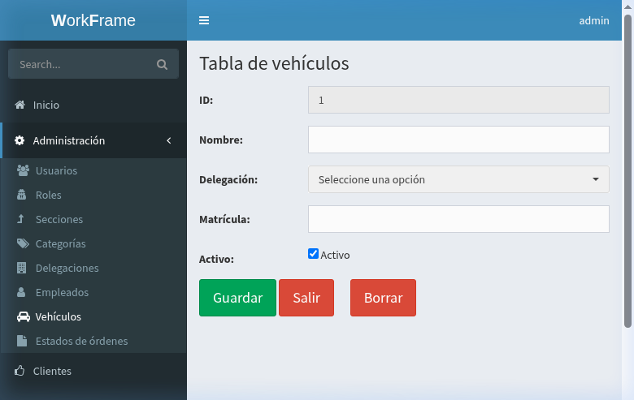

---

## 7. Gestión de Clientes

**URL del listado:** `/clientes`

### 7.1. Listado

| Columna | Descripción |
|---------|-------------|
| ID | Identificador |
| Nombre | Nombre del cliente (enlace a edición) |
| Persona de contacto | Contacto principal |
| Población | Localidad |
| Provincia | Provincia |
| Teléfono | Número de teléfono |
| Correo electrónico | Email |
| Informe | Enlace al informe del cliente |

**Buscador** y **Paginación** presentes.
Botones: Añadir, Listar, Salir.

### 7.2. Formulario de Edición

**URL:** `/clientes/cliente/{id}`

| Campo | Nombre HTML | Tipo |
|-------|-------------|------|
| ID | `id` | Numérico (solo lectura tras creación) |
| Nombre | `name` | Texto |
| Persona de contacto | `contact` | Texto |
| Dirección | `address` | Texto |
| C.P. | `zip` | Texto |
| Población | `locality` | Texto |
| Provincia | `town` | Texto |
| Teléfono | `telephone` | Texto |
| Correo electrónico | `email` | Email |

**Botones:** Guardar, Salir, Borrar.

**Patrón de creación:** Igual que empleados — primero se pide el ID, luego se despliega el formulario completo.

### 7.3. Anotaciones (Notas del Cliente)

Debajo del formulario de edición aparece una sección de **Anotaciones** con histórico.

**Crear nota:**
1. Pulsar "Insertar anotación" (redirige a `/clientes/notas/{id_cliente}`)
2. Escribir el texto en el área de texto
3. Pulsar "Guardar"

Las notas se muestran con fecha y texto, ordenadas cronológicamente.

### 7.4. Borrado

El botón **Borrar** implementa una **confirmación de doble clic**: al pulsar una vez, el texto cambia a "Borrar 1"; al pulsar de nuevo se ejecuta la eliminación.

> [!IMPORTANT]
> El sistema verifica dependencias antes de borrar (si el cliente tiene expedientes asociados, no se permite la eliminación).

---

## 8. Gestión de Expedientes (Proyectos)

**URL del listado:** `/expedientes`

### 8.1. Listado

| Columna | Descripción |
|---------|-------------|
| ID | Identificador |
| Nombre | Nombre del proyecto (enlace) |
| Cliente | Cliente asociado |
| Fecha | Fecha de apertura |
| Población | Localidad del proyecto |
| Provincia | Provincia |

### 8.2. Formulario de Edición

**URL:** `/expedientes/expediente/{id}`

| Campo | Tipo | Descripción |
|-------|------|-------------|
| ID | Numérico | Auto o manual |
| Nombre | Texto | Nombre del proyecto |
| Cliente | Dropdown | Selección del cliente |
| Fecha | Date | Fecha de apertura (auto si se deja vacío) |
| Población | Texto | Localidad |
| Provincia | Texto | Provincia |

**Botones:** Guardar, Salir, Borrar.

**Sección de Anotaciones y Órdenes de Trabajo:** Debajo del formulario se puede acceder al historial de notas del expediente y a las órdenes de trabajo vinculadas.

> [!NOTE]
> Al guardar, pueden aparecer avisos PHP (Notice) que no afectan a la funcionalidad.

---

## 9. Órdenes de Trabajo

**URL del listado:** `/ordenes`

### 9.1. Listado

| Columna | Descripción |
|---------|-------------|
| ID | Identificador |
| Estado | Estado de la orden |
| Nombre | Nombre de la orden |
| Expediente | Proyecto asociado |
| Fecha | Fecha de inicio |
| Finalización | Fecha prevista de fin |
| Hora de inicio | Hora de comienzo |
| Dirección | Ubicación de la obra |
| Código postal | CP |

### 9.2. Formulario de Edición

**URL:** `/ordenes/orden/{id}`

El formulario tiene dos secciones principales:

#### Sección 1: Notificación a Encargado
Muestra avisos sobre el estado del encargado y la disponibilidad de email para notificaciones.

#### Sección 2: Datos de la Orden

| Campo | Tipo | Descripción |
|-------|------|-------------|
| ID | Numérico (solo lectura) | |
| Estado | Dropdown | Activa / Finalizada / Cancelada |
| Nombre | Texto | Nombre de la orden (hereda del expediente si vacío) |
| Expediente | Dropdown | Proyecto asociado |
| Fecha | Date | Fecha de inicio |
| Finalización | Date | Fecha prevista de fin |
| Hora de comienzo | Time (HH:MM) | Hora de inicio |
| Encargado | Dropdown | Jefe de equipo responsable |
| Dirección | Texto | Ubicación de la obra |
| Código postal | Texto | CP |
| Población | Texto | Localidad |
| Provincia | Texto | Provincia |

#### Sección 3: Asignación de Recursos
- **Vehículos:** Selección múltiple de la flota disponible con detección de solapamientos (icono de advertencia ⚠️).
- **Operarios:** Selección múltiple de trabajadores con detección de solapamientos.

#### Sección 4: Notificación por Email
Botón **"Notificar a [email]"** que envía automáticamente un correo al encargado con los detalles de la obra.

#### Sección 5: Anotaciones
Sistema de notas cronológicas vinculadas a la orden.

**Botones:** Guardar, Salir, Borrar, Notificar.

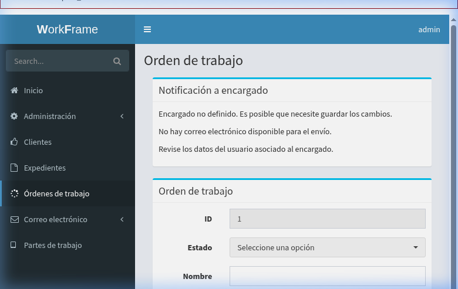

> [!WARNING]
> **[BUG LEGADO]** La creación de nuevas órdenes falla con error PHP: `Trying to access array offset on value of type bool` en `controllers/Ordenes.php`. La edición de órdenes existentes muestra avisos PHP pero funciona parcialmente.

---

## 10. Partes de Trabajo

**URL:** `/partes`

### 10.1. Acceso

Al acceder a Partes de Trabajo, el sistema solicita seleccionar un **Encargado de obra** (foreman) desde un dropdown. Solo se muestran los trabajadores que tienen una cuenta de usuario vinculada.

Tras seleccionar el encargado, se muestra el listado de sus obras activas. Si no tiene obras asignadas, se informa: *"[Nombre] no tiene asignada ninguna obra en estos momentos"*.

### 10.2. Formulario de Parte (Diseño Esperado)

Según el código fuente y la documentación técnica, el formulario de un parte de trabajo incluye:

| Campo | Tipo | Descripción |
|-------|------|-------------|
| ID | Numérico | Auto |
| Orden de trabajo | Referencia | OT asociada |
| Encargado | Referencia | Jefe de equipo |
| Fecha | Date | Fecha del parte |
| Hora ida | Time | |
| Hora vuelta | Time | |
| Hora mañana | Time | Horas trabajadas por la mañana |
| Hora tarde | Time | Horas trabajadas por la tarde |
| Dieta | Checkbox | Si hubo dietas |
| Montaje especial | Checkbox (`special_time`) | Incremento de coste/tiempo |
| Anotaciones | Textarea | Observaciones técnicas |
| Imagen (Obra) | File upload | Foto del trabajo realizado |
| Imagen (Factura) | File upload | Foto de factura/ticket |

> [!WARNING]
> **[BUG LEGADO]** El formulario de partes falla con error de base de datos: `Unknown column 'end_date' in WHERE clause`. La creación de partes no es posible en el estado actual de la aplicación.

---

## 11. Búsqueda Global

**URL:** `/buscar?cad={término}&search=`

El buscador del sidebar realiza búsquedas simultáneas en tres entidades:

1. **Clientes** — Busca por nombre
2. **Expedientes** — Busca por nombre
3. **Órdenes de trabajo** — Busca por nombre/ID

Los resultados se muestran agrupados por sección con enlace directo a cada registro y un icono verde ➕ para crear nuevos registros.

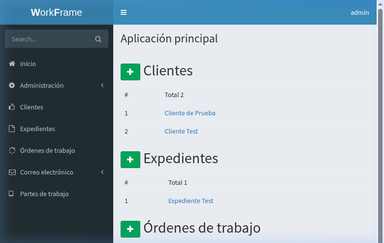

---

## 12. Informes/Reportes

**URLs:** `/reports/clientes`, `/reports/operarios`

El sistema prevé la generación de informes PDF para clientes y operarios usando la librería TCPDF.

> [!WARNING]
> **[BUG LEGADO]** Los reportes están rotos por incompatibilidad de TCPDF con PHP 7.3+ (`"continue" targeting switch is equivalent to "break"`).

---

## 13. Correo Electrónico

### 13.1. Configuración

**URL:** `/mail/config`

Panel de configuración SMTP para el envío de notificaciones.

### 13.2. Procesamiento

**URL:** `/mail`

Procesamiento de correos pendientes.

> [!WARNING]
> **[BUG LEGADO]** Ambas páginas fallan por falta del archivo `email.ini` de configuración (`parse_ini_file(email.ini): failed to open stream`).

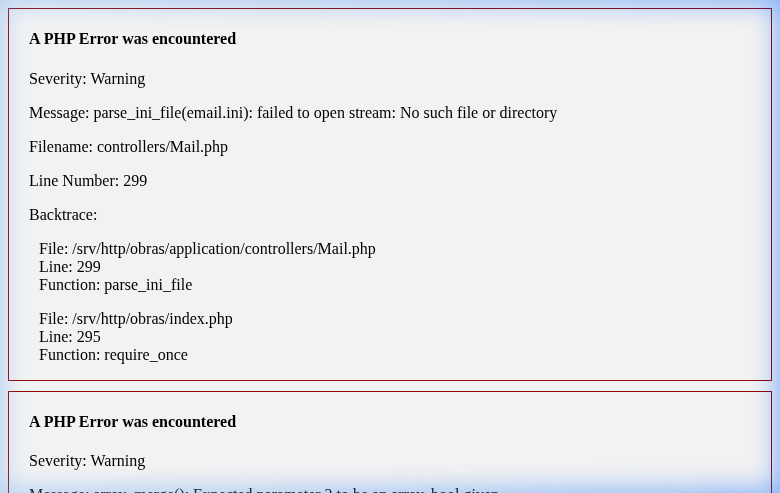

---

## 14. Patrones de Interfaz Comunes

### 14.1. Creación en Dos Pasos
Las entidades principales (Clientes, Expedientes, Órdenes, Vehículos, Trabajadores) siguen un patrón de creación en dos fases:
1. Formulario inicial solo con campo **ID** + botón "Guardar"
2. Al guardar se despliega el formulario completo

### 14.2. Confirmación de Borrado
El botón "Borrar" requiere **doble clic**: primer clic cambia el texto a "Borrar 1", segundo clic ejecuta la eliminación.

### 14.3. Edición Inline (Tablas Maestras)
Secciones, Categorías, Delegaciones, Estados y Roles usan edición directa en la tabla (sin formulario separado).

### 14.4. Notas / Anotaciones
Clientes, Expedientes y Órdenes tienen un sistema de notas cronológicas con:
- Botón "Insertar anotación"
- Formulario con textarea en página separada
- Historial visible debajo del formulario principal

---

## 15. Resumen de Bugs/Incompletitudes Legadas

| Sección | Estado | Bug |
|---------|--------|-----|
| Secciones (Añadir) | ❌ ROTO | 404 al crear |
| Órdenes de Trabajo (Crear) | ❌ ROTO | PHP error en Ordenes.php |
| Partes de Trabajo | ❌ ROTO | Error de BD (`end_date`) |
| Reportes | ❌ ROTO | TCPDF incompatible con PHP 7.3+ |
| Correo electrónico | ❌ ROTO | Falta `email.ini` |
| PHP Notices | ⚠️ Avisos | Avisos al guardar (no bloquean) |
| Categorías | ✅ OK | CRUD funcional |
| Delegaciones | ✅ OK | CRUD funcional |
| Estados | ✅ OK | CRUD funcional |
| Usuarios | ✅ OK | Gestión funcional |
| Empleados | ✅ OK | CRUD funcional |
| Vehículos | ✅ OK | CRUD funcional |
| Clientes | ✅ OK | CRUD + notas funcional |
| Expedientes | ✅ OK | CRUD funcional |
| Búsqueda | ✅ OK | Funcional |
